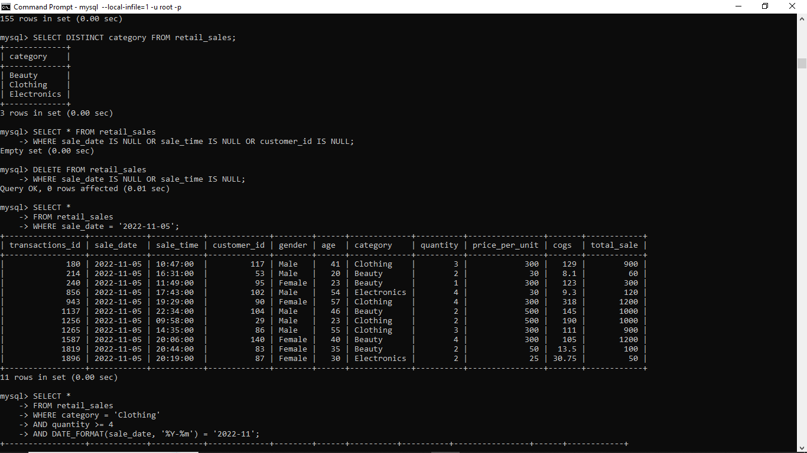
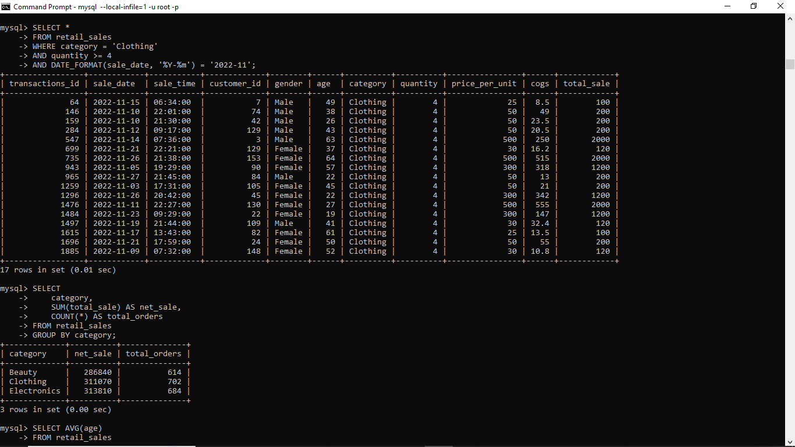
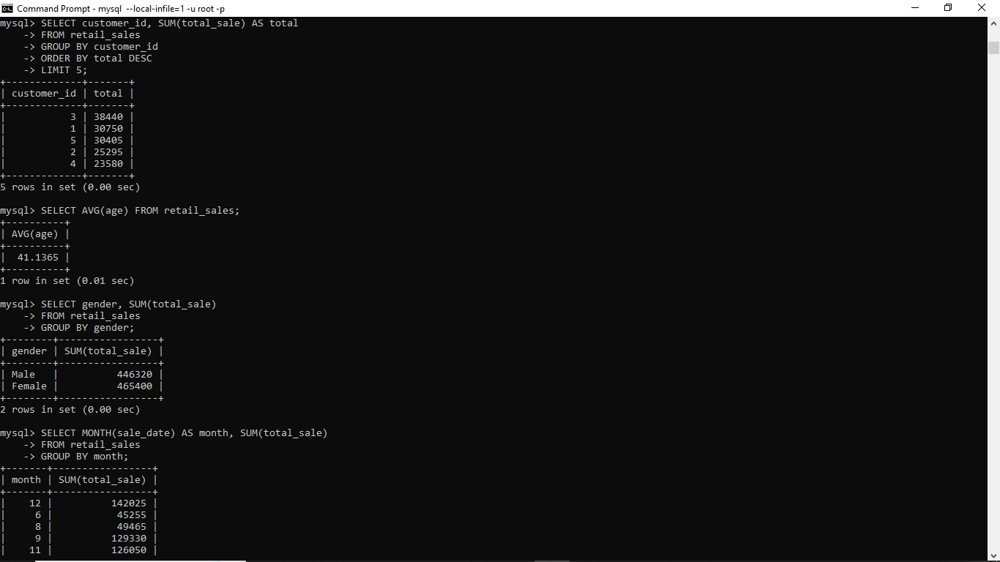

# 🛒 Retail Sales Analysis using SQL

## 📌 Project Overview

This project analyzes retail sales data to extract meaningful business insights such as customer behavior, product performance, and time-based sales trends using SQL.

---

## 🎯 Objectives

* Analyze sales performance across product categories
* Identify top customers and revenue contributors
* Understand monthly and time-based sales trends
* Perform data cleaning for accurate analysis

---

## 🛠️ Tools Used

* MySQL
* SQL (Joins, Aggregations, Window Functions)
* CSV Dataset

---

## 📂 Project Structure

* `data/` → Dataset
* `sql/` → SQL queries
* `outputs/` → Result screenshots

---

## 📁 Dataset Description

The dataset contains retail transaction data including:

* Customer ID
* Product category
* Sale date and time
* Quantity and total sales

This dataset is used to analyze sales trends and customer purchasing behavior.

---

## 📊 Sample Outputs

### Top Customers



### Category Sales



### Monthly Trend



---

## 🚀 How to Run

1. Create database:

   ```sql
   CREATE DATABASE retail_db;
   USE retail_db;
   ```

2. Run the following files:

   * `schema.sql`
   * `data_cleaning.sql`

3. Execute analysis:

   * `analysis.sql`
   * `advanced_analysis.sql`

---

## ⚙️ Execution

All SQL queries were executed using MySQL Command Line.

---

## 💡 Key SQL Concepts Used

* Window Functions (RANK)
* Aggregations (SUM, AVG)
* Date Functions (EXTRACT)
* CASE statements

---

## 📈 Business Insights

* Clothing category contributes the highest revenue
* Peak sales observed during festive months
* Top customers significantly drive total revenue
* Afternoon time shows highest order volume

---

## 🛠 Skills Used

* SQL (Joins, Aggregations, Window Functions)
* Data Cleaning
* Exploratory Data Analysis (EDA)
* Business Insight Generation

---

## 🚀 What I Learned

* Writing optimized SQL queries
* Handling real-world datasets
* Extracting business insights from raw data

---

## 🎯 Conclusion

This project demonstrates practical SQL skills applied to real-world retail data for generating actionable business insights.
